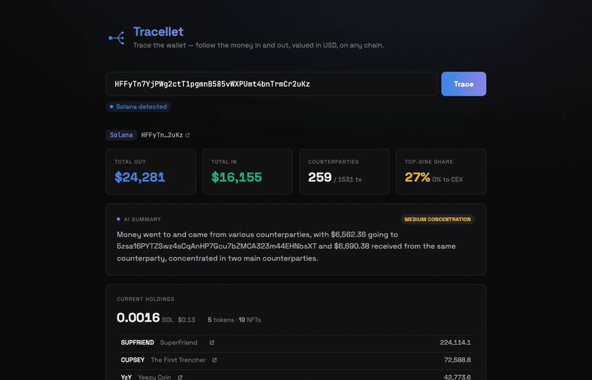
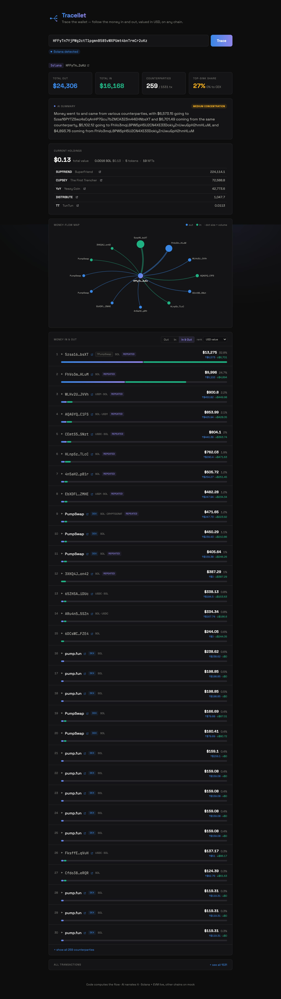

<p align="center">
  
</p>

# Tracellet — Trace the Wallet

Paste any wallet and see exactly where its money went and came from, across Solana and
Ethereum, native coins and tokens, all valued in USD.

<!-- Live demo: add the link here once deployed -->

<p align="center">
  
</p>

Most "wallet checkers" show you a balance. Tracellet answers the harder question:
**follow the money.** It pulls a wallet's full history, groups it by who the funds
actually moved to and from, prices every transfer in USD so a SOL move and a USDC move
sit in the same ranked list, verifies the labels it shows, and draws the whole thing as
a network map. Chain is detected straight from the address — Solana and EVM are live.

## What makes it more than a demo

**It values everything in USD.** Native coins *and* tokens are priced (via DeFiLlama)
and ranked together, so a wallet that mostly moves stablecoins isn't invisible.

**Labels are verified, not guessed.** A "pump.fun" tag survives only if the
counterparty's on-chain account is actually program-owned. A plain wallet that happened
to be in a pump.fun trade shows up as its address with a muted `?` — never a false claim.

**Code decides, AI narrates.** A deterministic engine computes every number; the language
model only writes the summary, over figures it can't change. Even the chain is classified
by a regex, not the model — it's the one step everything depends on.

**Both directions, drill-downs, and a flow map.** Toggle money out / in / both, rank by
USD or by count, expand any counterparty down to its individual transactions, and read it
all as a wallet-centered graph. Every row links out to the block explorer.

<p align="center">
  
</p>

## Run it

```bash
./scripts/dev.sh                 # both servers — web on :5173, API on :3000
./scripts/trace.sh <wallet>      # a quick report straight from the API
```

Needs [Bun](https://bun.sh). Live data uses free API keys in `server/.env` (see
`.env.example`): Helius for Solana, Etherscan for EVM, Groq for the summary. Without them
it falls back to mock data and a templated summary, so it still runs end to end.

## Under the hood

React + Vite + Tailwind on the front, Bun + Hono on the back. Every chain sits behind one
`getWalletTransfers()` interface — live adapters for Solana and EVM, a mock layer for the
rest — so the engine and the UI never change when a new chain comes online.

For how it was built, and where AI helped versus where it didn't, see [DEVLOG.md](DEVLOG.md).
