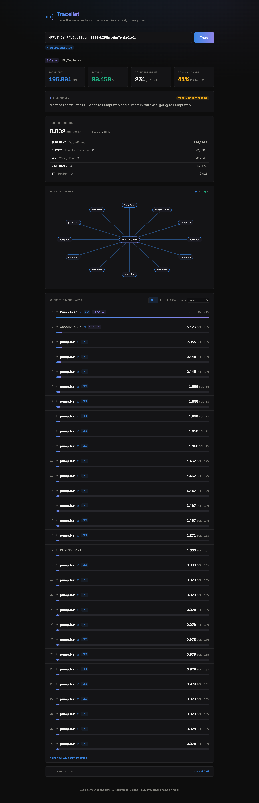

<p align="center">
  
</p>

# Tracellet — Trace the Wallet

Paste any wallet address and follow its money **in and out**: every transfer,
aggregated by counterparty, ranked, with entity labels, current holdings, and a
plain-language summary. Multi-chain — the chain is detected from the address format,
so the same tool works for Ethereum, Solana, Bitcoin, Tron and more.

<p align="center">
  
</p>

> **Design principle:** *Code decides, AI narrates.* The chain is classified by a
> deterministic regex (not the LLM), and every number — totals, per-counterparty
> sums, concentration — is computed in a pure engine. The LLM only receives that
> clean structured JSON and turns it into a plain-language summary. It never sees raw
> chain data and is told to quote fields verbatim, which keeps the analysis testable
> and the AI honest.

## What it does

1. Enter a wallet address
2. **`detectChain()`** classifies the chain from the address format — deterministic,
   instant, no LLM. (`0x…` → EVM, base58 → Solana, `bc1…`/`1…`/`3…` → Bitcoin, `T…`
   → Tron.) All EVM chains share one address format, so a `0x…` address defaults to
   Ethereum with a chain selector in the UI.
3. The backend fetches the wallet's transfers — **both directions** — plus its current
   holdings. **Solana (Helius) and EVM (Etherscan) are live**; Bitcoin and Tron run on
   a mock layer for now.
4. **`buildFlowReport()`** — the pure engine — aggregates by counterparty (out/in
   amounts, net, per-direction tx counts), computes concentration and exchange
   cash-out, and raises flags (`cash-out`, `single-large`, `repeated`, `mixer`).
5. Entity labels turn raw addresses into names — a curated, verified address map plus
   the protocol each transfer flowed through (pump.fun, Jupiter, Raydium…).
6. Groq (Llama) narrates the structured report into a short summary + concentration
   verdict.
7. The dashboard shows stat tiles, the AI summary, current holdings (balance + tokens
   + NFTs), a **money-flow map** (wallet-centered network graph, edges weighted by
   amount and colored by direction), and a ranked counterparty flow you can toggle
   **Out / In / In & Out**, re-rank, drill into per-transaction, and expand to every
   transaction — each row linking out to the chain's explorer.

## Stack

- **Frontend:** React + Vite + Tailwind (dark, minimal, blue→violet accent)
- **Backend:** Bun + Hono
- **Data:** live adapters (Helius for Solana) + a mock layer, behind one
  `getWalletTransfers(wallet, chainId?)` interface
- **LLM:** Groq (free tier, Llama)

## Run

```bash
./scripts/dev.sh                 # starts both servers, prints URLs
./scripts/trace.sh <wallet>      # quick report from the API
```

Keys live in `server/.env` (see `.env.example`): `GROQ_API_KEY` (AI narration),
`HELIUS_API_KEY` (live Solana), `ETHERSCAN_API_KEY` (live EVM). The app degrades
gracefully without them — a template summary stands in for the LLM.

## Endpoints

- `POST /detect { wallet }` → detected chain + selectable options (EVM is ambiguous)
- `POST /trace { wallet, chainId? }` → the full `FlowReport` (transfers, holdings, AI summary)

## Going live (mock → real data)

All chain data lives behind one interface in `server/src/data/index.ts`. Solana
(Helius) and EVM (Etherscan V2 — one key covers Ethereum/Base/Arbitrum/Polygon/BSC)
are wired in `server/src/data/live.ts`; the remaining families follow the same shape
(a UTXO indexer for Bitcoin, TronGrid for Tron) — the engine and frontend don't change.

## How AI was used building this

- **Scaffolding & boilerplate:** delegated the initial Hono routes and Vite setup,
  then reviewed and restructured.
- **Flow logic:** the aggregation engine (`flow.ts`) and chain classifier
  (`chains.ts`) were written and reviewed by hand — these are the parts that must be
  correct, so AI was used for rubber-ducking edge cases (EVM address ambiguity,
  Bitcoin UTXO change outputs), not authoring.
- **Deliberate call — chain detection is code, not the LLM:** an address's chain is
  a format fingerprint, so classifying it with the model would be slower, cost a
  call, and occasionally be wrong. Keeping it deterministic is the whole thesis.
- **Prompt design:** the narration prompt is given only the structured report and
  told to quote fields verbatim and never invent numbers — the fix that stopped the
  model hallucinating figures.

See `DEVLOG.md` for the running log and `HANDOFF.md` for current state.
